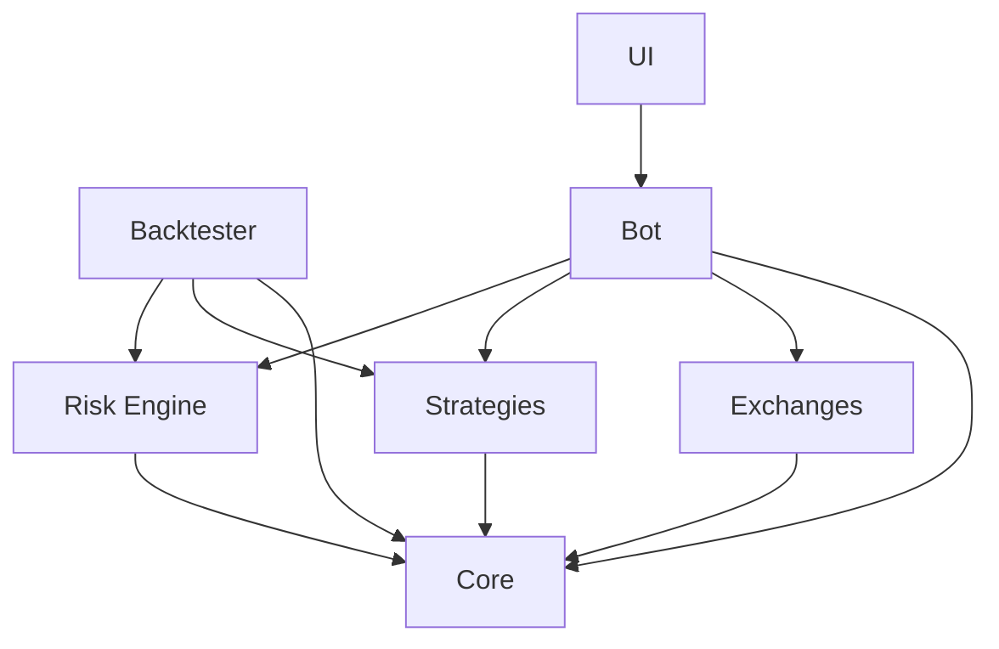

# Trading Bot Monorepo

A sophisticated TypeScript-based trading bot monorepo built with npm workspaces, featuring live trading, backtesting, risk management, and a real-time dashboard.

## 🏗️ Architecture

This monorepo consists of 7 packages organized in a modular architecture:

```
trading-bot/
├── packages/
│   ├── core/           # Shared types, utilities, logging, configuration
│   ├── exchanges/      # Multi-exchange connector abstractions (viem, wagmi, ethers)
│   ├── strategies/     # Hot-reloadable trading strategy base classes
│   ├── risk-engine/    # Position sizing, drawdown controls, circuit breakers
│   ├── backtester/     # Event-driven historical trading simulator
│   ├── bot/            # Live trading orchestrator
│   └── ui/             # React dashboard with Tailwind + Recharts + dark mode
```

### Package Dependencies



## 🚀 Quick Start

### Prerequisites

- Node.js >= 18.0.0
- npm >= 8.0.0

### Installation

```bash
# Clone the repository
git clone https://github.com/Germinsky/tradingbot.git
cd tradingbot

# Install all dependencies
npm install

# Build all packages
npm run build
```

### Running the Bot

1. Configure environment variables:

```bash
cd packages/bot
cp .env.example .env
# Edit .env with your settings (RPC URL, strategy params, etc.)
```

2. Start the trading bot with API server:

```bash
npm run bot
```

The bot will start on port 3001 with REST API endpoints.

### Running the Dashboard

In a separate terminal:

```bash
npm run ui
```

The dashboard will be available at `http://localhost:3002`

Access the API directly at `http://localhost:3001/api/status`

## 📦 Packages

### @trading-bot/core

Foundation package providing:
- **Types**: Market data, orders, positions, strategy interfaces
- **Logging**: Singleton logger with configurable levels
- **Config**: Environment and file-based configuration loading with Zod validation
- **Utils**: PnL calculations, formatting, retry logic

### @trading-bot/exchanges

Exchange abstraction layer:
- **BaseExchange**: Abstract class for exchange implementations
- **UniswapExchange**: Example Uniswap connector using viem
- **Perpetual DEX Adapters**: Support for decentralized perpetual futures
  - **GMX V2** (Arbitrum & Avalanche) - Up to 50x leverage
  - **Gains Network** (Polygon & Arbitrum) - Up to 150x leverage
  - **dYdX V4** (Cosmos chain) - Up to 20x leverage, WebSocket support
  - **Perpetual Protocol V2** (Optimism) - Up to 10x leverage, vAMM-based
  - **Kwenta** (Synthetix on Optimism) - Up to 25x leverage
- Supports: Market data fetching, order submission, position tracking, real-time PNL
- Extensible for multiple DEXes and CEXes

### @trading-bot/strategies

Strategy framework:
- **BaseStrategy**: Abstract strategy class with lifecycle hooks
- **StrategyLoader**: Hot-reload strategies without restarting
- **GridStrategy**: Example grid trading implementation
- File watching for dynamic strategy updates

### @trading-bot/risk-engine

Risk management system:
- **PositionSizer**: Fixed, Kelly criterion, and percentage-based sizing
- **DrawdownMonitor**: Real-time drawdown tracking with high water mark
- **RiskManager**: Circuit breakers, position limits, stop-loss/take-profit
- Validates all orders before execution

### @trading-bot/backtester

Historical simulation:
- **EventQueue**: Time-ordered event processing
- **Backtester**: Simulates trading with commission and slippage
- **PerformanceMetrics**: Sharpe ratio, max drawdown, win rate, profit factor
- Event-driven architecture for accurate simulation

### @trading-bot/bot

Live trading orchestrator:
- **TradingBot**: Main bot class coordinating all systems
- **REST API**: Express server on port 3001 with 7 endpoints
  - `GET /api/status` - Bot status and metrics
  - `POST /api/start` - Start trading
  - `POST /api/stop` - Stop trading
  - `GET /api/positions` - Current positions
  - `GET /api/orders` - Order history
  - `POST /api/orders` - Submit manual orders
  - `GET /health` - Health check
- Event emitters for state changes
- Graceful shutdown handling
- Optional hot-reload for strategies
- Market data subscription and order execution

### @trading-bot/ui

React dashboard (port 3002):
- **Dark mode** by default with Tailwind CSS
- **Real-time charts** with Recharts (equity curve)
- **Positions list** with live P&L
- **Order history** with filtering
- **Bot controls**: Start/Stop buttons
- **Manual trading**: Order submission form
- **Connection status**: Real-time API monitoring
- **Error handling**: Graceful error display
- **Zustand** for state management
- Vite for fast development

## 🛠️ Development

### Build all packages

```bash
npm run build
```

### Run in development mode

```bash
npm run dev
```

### Lint and format

```bash
npm run lint
npm run format
```

### Type checking

```bash
npm run typecheck
```

## 📊 Using the Backtester

Example usage:

```typescript
import { GridStrategy } from '@trading-bot/strategies';
import { RiskManager } from '@trading-bot/risk-engine';
import { Backtester } from '@trading-bot/backtester';

const strategy = new GridStrategy({
  gridSize: 10,
  gridSpacing: 50,
  basePrice: 2000,
  quantity: 0.1,
});

const riskManager = new RiskManager({
  positionSizer: { accountBalance: 10000, riskPerTrade: 0.02, method: 'fixed' },
  drawdownMonitor: { maxDrawdown: 0.1, highWaterMark: 10000 },
  maxPositionSize: 1000,
  stopLossPercent: 0.02,
  takeProfitPercent: 0.05,
});

const backtester = new Backtester(
  { initialCapital: 10000, commission: 0.001, slippage: 0.001 },
  strategy,
  riskManager
);

// Load historical data
backtester.loadHistoricalData(marketData);

// Run backtest
const metrics = await backtester.run();
console.log(metrics.getSummary());
```

## 📈 Perpetual Futures Trading

The bot now supports decentralized perpetual futures trading across 5 major protocols:

### Supported Protocols

| Protocol | Chains | Max Leverage | Features |
|----------|--------|--------------|----------|
| **GMX V2** | Arbitrum, Avalanche | 50x | 30-decimal precision, low fees |
| **Gains Network** | Polygon, Arbitrum | 150x | Highest leverage, TP/SL orders |
| **dYdX V4** | Cosmos chain | 20x | Orderbook-based, WebSocket |
| **Perpetual Protocol V2** | Optimism | 10x | vAMM-based, USDC collateral |
| **Kwenta** | Optimism | 25x | Synthetix perps, Chainlink oracles |

### Quick Start with Perpetuals

```typescript
import { createGMXArbitrumAdapter, createGainsPolygonAdapter } from '@trading-bot/exchanges';

// GMX on Arbitrum
const gmx = createGMXArbitrumAdapter(
  'https://arb1.arbitrum.io/rpc',
  '0x...' // your private key
);

await gmx.connect();

// Open a leveraged position
const position = await gmx.openPosition({
  symbol: 'ETH/USD',
  side: 'long',
  size: 1.0,      // 1 ETH
  leverage: 10,   // 10x leverage
  slippage: 0.005 // 0.5%
});

// Subscribe to real-time updates
gmx.on('positionUpdate', (pos) => {
  console.log(`PNL: $${pos.unrealizedPnl.toFixed(2)}`);
  console.log(`Liquidation: $${pos.liquidationPrice.toFixed(2)}`);
});

gmx.subscribeToPosition(position.id);
```

### Features

- **Unified Interface**: All protocols implement the same `PerpAdapter` interface
- **Real-Time Updates**: Event-driven position tracking with 2-3 second polling
- **Multi-Chain**: Support for 5+ blockchains
- **Live PNL Tracking**: Automatic unrealized PNL calculations
- **Risk Management**: Liquidation price tracking and monitoring
- **Funding Rates**: Query hourly funding costs across all protocols

See [PERPETUAL_ADAPTERS.md](packages/exchanges/PERPETUAL_ADAPTERS.md) for complete documentation.

## 🔧 Configuration

The bot uses environment variables for configuration. See `packages/bot/.env.example`:

```env
# Exchange
EXCHANGE_NAME=uniswap
RPC_URL=https://eth-mainnet.g.alchemy.com/v2/YOUR-API-KEY

# Strategy
STRATEGY_NAME=grid
STRATEGY_PARAMS={"gridSize":10,"gridSpacing":50,"basePrice":2000,"quantity":0.1}

# Risk Management
MAX_POSITION_SIZE=1000
MAX_DRAWDOWN=0.1
STOP_LOSS_PERCENT=0.02
TAKE_PROFIT_PERCENT=0.05

# Logging
LOG_LEVEL=info
```

## 🎯 Key Features

### Hot-Reloadable Strategies
Modify strategy files and the bot will automatically reload them without restarting.

### Event-Driven Architecture
All systems communicate via events for maximum flexibility and testability.

### Risk-First Design
Every order passes through risk validation before execution.

### Comprehensive Backtesting
Realistic simulation with commission, slippage, and performance metrics.

### Real-Time Monitoring
Beautiful dashboard with live charts and position tracking.

## 🧪 Testing

```bash
# Run tests (when implemented)
npm test
```

## 📝 License

MIT

## 🤝 Contributing

Contributions welcome! Please read the contributing guidelines first.

## ⚠️ Disclaimer

This software is for educational purposes only. Use at your own risk. Trading involves substantial risk of loss. Always test strategies thoroughly before live trading.

## 🔗 Tech Stack

- **TypeScript**: Type-safe development
- **Node.js**: Runtime environment
- **viem**: Modern EVM interactions (v2.38.3)
- **wagmi**: React hooks for Ethereum
- **ethers v6**: Additional Ethereum library
- **React 19**: UI framework
- **Tailwind CSS**: Utility-first styling
- **Recharts**: Charting library
- **Zustand**: State management
- **Turbo**: Monorepo build system
- **Express**: REST API server

### Perpetual Trading Stack
- **Multi-chain support**: Arbitrum, Avalanche, Polygon, Optimism, Cosmos
- **WebSocket**: Real-time market data (dYdX, Kwenta)
- **Event-driven**: Position updates via EventEmitter
- **5 Protocol Integrations**: GMX, Gains Network, dYdX, Perp Protocol, Kwenta
- **Zustand**: State management
- **Zod**: Runtime validation
- **Turborepo**: Build caching
- **Vite**: Frontend tooling
- **ESLint + Prettier**: Code quality
